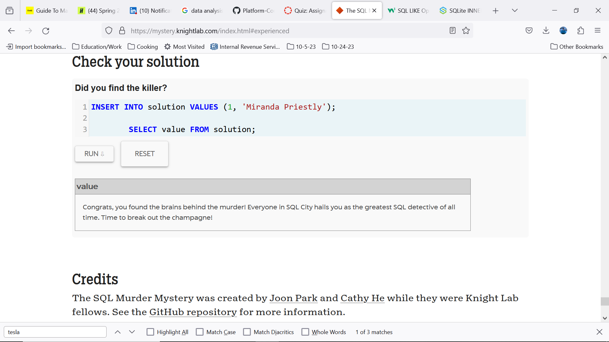

# Metric Tracker with Database

PROVIDE OVERVIEW OF ASSIGNMENT HERE

Time spent: **NUMBER_HOURS_SPENT** hours spent in total

## Features

The following **required** features are completed:

- [X] Organize Github projects for Assignment 3 (2 pts)
- [X] Complete SQL Mystery Walkthrough and take a screenshot or print to PDF the webpage (2 pts)
- [X] Complete Interactive MongoDB Tutorial and take a screenshot or print to PDF the webpage  (2 pts)
- [X] Choose a SQL or NoSQL Database and set up a server (4 pts)
- [X] Modify your metric_tracker file so that the metrics are saved onto a database (5 pts)

The following **bonus** features are implemented:

- [X] Retrieve values from the database (1 pt).
- [ ] Create separate Tables (SQL) or Documents (NoSQL) for each metric and relate them via user (2 pt).
- [ ] DESCRIBE ANY OTHER FEATURES HERE.

## Screenshot and/or Video Walkthrough

## Notes:
PROVIDE RELEVANT OR ADDITIONAL INFORMATION HERE. Below are formatting options to add emphasis in text
<ul>
  <li>**Example in bold**</li>
  <li>*Example in italics*</li>
</ul>
